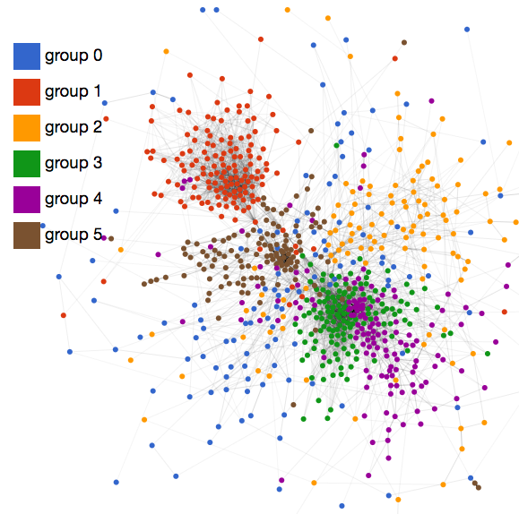
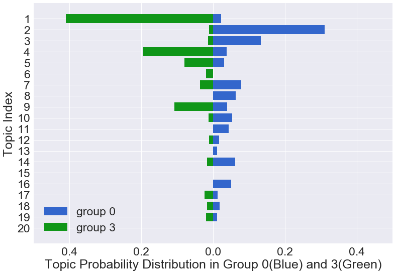
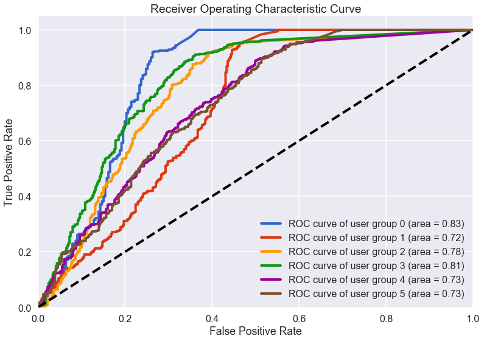

# [News4U](https://www.yuanhuang.club/news)

*Recommend stories based on collaborative reader behavior*

### What is News4U

Online news reading has become very popular as the web provides access to news articles from millions of sources around the world. A critical problem is that the volumes of articles can be overwhelming to the readers. Therefore, building a news recommendation system to help users find news that are interesting to read is a crucial task for every online news service. 

News recommendations must perform well on fresh content: breaking news that hasn’t been viewed by many readers yet. Thus we need to leverage on the article content data available at publishing time, such as topics, categories, and tags, to build a content-based model, and match it to readers’ interests learnt from their reading histories. However, one drawback of the content-based recommendations is that when there’s not enough history about a user, the coverage of the recommendations will become very limited, which is the common cold-start problem in recommender systems.

News4U is a news recommendation engine which combines collaborative filtering with content-based filtering to try to make news recommendations more diverse. This so-called hybrid-filtering recommendation system takes into account not only the content of the articles and the user’s reading history, but also the reading history of people who share similar interests. By learning from the history of people with similar interests, this engine will recommend news with a much broader coverage of topics, even when the history information about a particular user is very limited. 

### Using News4U

Input your Twitter handle, the app will try to understand your interest on news based on what articles have you read and retweeted on Twitter. The app will find the user group who share similar interests with you, provide you the potential topics you might be interested in, and recommend news with topics your  group would like. On the web app, you can directly read the whole article, or follow the link to the original site to find more details.

### How News4U works

 In this section, I’ll explain how I build the recommendation engine from the ground up.

* Step 1: [Finding readers with similar interests](#finding-readers-with-similar-interests)

* Step 2: [Topic modeling](#topic-modeling)

* Step 3: [Making recommendations](#making-recommendations)

* Step 4: [Evaluation of the recommender](#evaluation-of-the-recommender)

#### Finding readers with similar interests

As the first step, the engine identifies readers with similar interests on news based on their retweeting behavior of news posted on twitter. The data was collected from news posted on twitter by three different publishers (New York Times, Washington Post, and Bloomberg) for half a month. The information of all the twitter users who are retweeting the articles are also requested from Twitter. By looking at how many news posts each two users share in common, we can define a cosine similarity score for the users. Therefore a user network can be constructed by assigning the weight of link between two users to their similarity.

Applying hierarchical clustering algorithm to the user network, we can detect the community structures among the readers. The hierarchical clustering algorithm uses a greedy method to try to optimize the modularity of clusters. The modularity is an important metric for network clustering, which indicates how dense the connections within clusters are compared to the connections between different clusters. In our user network, the modularity score of the hierarchical clustering algorithm peaks at 6 clusters with value 0.151. 

#### Topic modeling

In order to understand the topics of news articles, I used a natural language processing tool called Latent Dirichlet Allocation (LDA) model that allows computers to identity hidden topics of documents based on the cooccurrence frequency of words collected from those documents. LDA can also help find out how much of an article is devoted to a particular topic, which allows the system to categorize an article, for instance, as 50% environment and 40% politics.

I trained the LDA model on the texts of more than 8,000 articles collected using a package newspaper. The number of topics was chosen by trying to achieve a diverse topic coverage without having too many topics. The diversity of topics can be evaluated by the average Jaccard similarity between topics. High Jaccard similarity indicates strong overlap and less diversity between topics, while low similarity means the topics are more diverse and have a better coverage among all the aspects in the articles.

The interests among different topics from user group can be learnt from the topics of articles with a high number of retweets by the readers in the group. By aggregating the topics of each article weighted by the number of retweets, we can obtained the topic probability distribution for all the user groups.

#### Making recommendations

Now that we divided the users into different groups based on their similarity and identified their interests among different topics, the next step is to build a content-based news articles recommendation by matching the topics of the fresh news with the topic profile of each user group. In other words, our recommendation engine doesn’t provide personalized recommendations sorely based on a particular user’s interest, but instead gives group-based recommendations in order to obtain a more diverse result. 

When recommending new articles to a user group, we want to find articles that have the most similar topics with the group’s interests. A similarity score between each new article and the group is calculated as the cosine similarity of their topic distributions. Ranking by the similarity scores, the best-matching articles will be recommended to all the readers within the reader group.

#### Evaluation of the recommender

Okay, that was cool. But how do I know whether the recommendation engine is working well or just spitting out random selections? How much will the readers like the recommendations that they get? In fact, the evaluation of a recommending system can be quite tricky. The golden metric for a recommending system is how much the system will add value to the reader and business. Ultimately, you want to perform A/B testing to see whether recommendations will increase usage, subscriptions, clicks, etc.

However, in practice there are other common metrics to evaluate a recommender, which can still help us gain some insights of the performance before actually putting the system into use. Most of these offline methods need us to hold out a subset of the items from the training data set (in our case, holding out a subset of previously retweeted news posts), pretending the users haven’t seen these items and trying to recommend them back to the users. Since the reader groups’ history about this test set already exists, we can leverage on this information to validate the performance of recommender.

One natural goal of recommender systems is to distinguish good recommendations from bad ones. In the binary case, this is very natural — a “1” is a good recommendation, while “0” means a bad recommendation. However, since the data that we have (number of retweets of an article by users from a user group) is non-binary, a threshold must be chosen such that all ratings above the threshold are good and called “1”, while the rest are bad with label “0”. A natural way to set the threshold is to choose the median value of the number of retweets in a user group, leaving all the articles above median “good” recommendations and all the rest “bad”. The predicted score from the recommending system is the cosine similarity between the topics of an article and the topics in a user group, which ranges from 0 to 1.

This good/bad, positive/negative framework is the same as binary classification in other machine learning settings. Therefore, standard classification metrics could be useful here. Two basic metrics are precision and recall. In our project, precision is fraction of good recommendations we got correct, out of all the articles got recommended by the system. Recall is the fraction good recommendations we got correct, out of all the “good” articles in the test set. 

All these metrics are clear once we have defined the threshold of good/bad in our predictions. For instance, in a binary situation our labels are 0, 1 while our predictions are continuous from 0–1. To compare the predictions, we select a threshold (here we choose the median value of all the predictions), above which we call predictions 1 and below 0. From 10 rounds of validations with 1000 hold-out articles, the average precision score of our recommending system is 65.9%, while the average recall is 66.5%.

The choice of the threshold is left to the user, and can be varied depending on desired tradeoffs. Therefore to summarize classification performance generally, we need metrics that can provide summaries over this threshold. One tool for generating such a metric is the Receiver Operator Characteristic (ROC) curve, which plots the True Positive Rate (TPR) versus the False Positive Rate (FPR) at different threshold levels. The area under the curve (often referred to as the AUC) indicates the probability that a classifier will rank a randomly chosen positive instance higher than a randomly chosen negative one. The average AUC of our recommender is 0.77, which is a fair score that can provide some insight on the predictive power of our model.

### Summary & What’s Next

The framework of this recommendation engine is quite versatile: it can be adapted to combine data from different platforms (Twitter, Facebook, news websites) to construct the user network; if combined with more personal information from the users, the system can also be developed to analyze user behavior and help making better marketing and advertising decisions.
